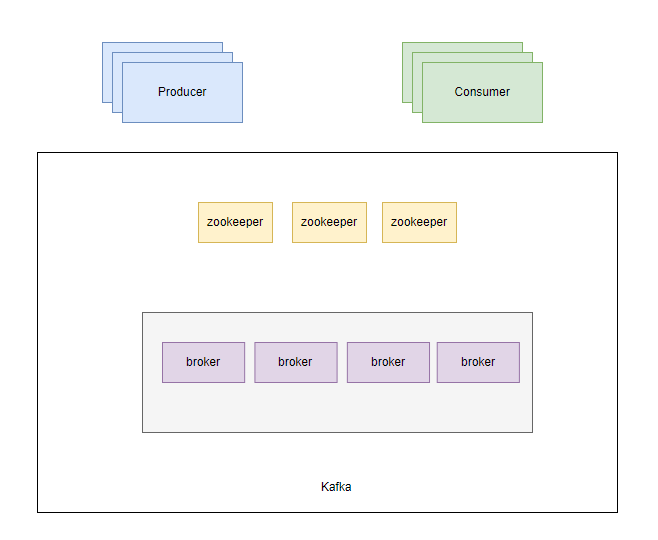
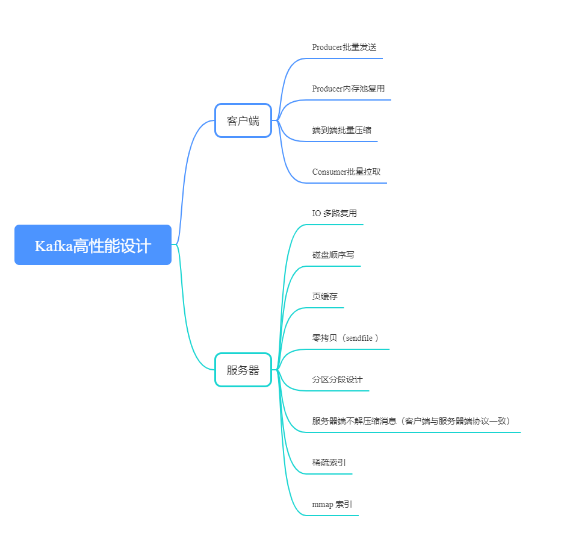

# Kafka核心设计

## 架构设计

kafka为分布式消息系统，由多个broker组成。消息是通过topic来分类的，一个topic下存在多个partition,每个partition又由多个segment构成。

### 架构图

在2.8版本之前，元数据都是存储在zookeeper，暂且使用老的架构描述。

### Topic逻辑结构

### 日志目录结构

## 数据可靠性设计

当Producer向Leader发送数据时,可以通过`request.required.acks`参数设置数据可靠性的级别

1. **0:** 不论写入是否成功,server不需要给Producer发送Response,如果发生异常,server会终止连接,触发Producer更新meta数据;

2. **1:** Leader写入成功后即发送Response,此种情况如果Leader fail,会丢失数据

3. **-1:** 等待所有ISR接收到消息后再给Producer发送Response,这是最强保证
   
   
   

仅设置acks=-1也不能保证数据不丢失,当Isr列表中只有Leader时,同样有可能造成数据丢失。要保证数据不丢除了设置acks=-1, 还要保 证ISR的大小大于等于2,具体参数设置:

   (1).`request.required.acks`:设置为-1 等待所有ISR列表中的Replica接收到消息后采算写成功;
   (2).`min.insync.replicas`: 设置为大于等于2,保证ISR中至少有两个Replica

Producer要在吞吐率和数据可靠性之间做一个权衡

## 数据一致性设计

一致性定义:若某条消息对Consumer可见,那么即使Leader宕机了,在新Leader上数据依然可以被读到

1. **HighWaterMark**

简称HW: Partition的高水位，取一个partition对应的ISR中最小的LEO(LogEndOffset)作为HW，消费者最多只能消费到HW所在的位置，另外每个replica都有HW，leader和follower各自负责更新自己的HW状态，HW<= leader. LEO

2. **对于Leader新写入的msg**

Consumer不能立刻消费，Leader会等待该消息被所有ISR中的replica同步后,更新HW,此时该消息才能被Consumer消费，即Consumer最多只能消费到HW位置

这样就保证了如果Leader Broker失效,该消息仍然可以从新选举的Leader中获取。对于来自内部Broker的读取请求,没有HW的限制。同时,Follower也会维护一份自己的HW,Folloer.HW = min(Leader.HW, Follower.offset)

## 高性能设计

可以从两个方面来分析：客户端和服务器端。除了Kafka服务器端优秀设计之外，端到端批量压缩绝对算的上Kafka高性能设计的秘密武器。

## 参考

1. [Apache Kafka DESIGN](https://kafka.apache.org/documentation/#design)

